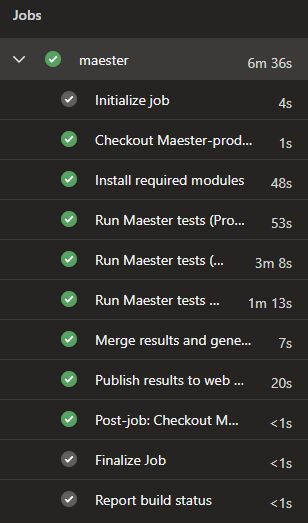

# Azure DevOps Pipeline

For automated monitoring we use an Azure DevOps pipeline with separate service connections per tenant. Each one uses workload identity federation to authenticate with read-only permissions.

The pipeline uses a `${{ each }}` loop to generate a step per tenant, so adding more tenants is just adding another entry to the YAML.



## Prerequisites

**Per tenant:**
- An **app registration** with the required [Microsoft Graph read permissions](https://m365advisor.dev/docs/installation#permissions) granted with admin consent
- A **workload identity federation service connection** in Azure DevOps pointing to the app registration

**For publishing:**
- An **Azure Web App** to host the report (see the M365Advisor results on Azure Web App guide for how to set one up)
- A **service connection** with Website Contributor role on the web app

**M365Advisor module:**
- Latest version with multi-tenant support (`Merge-MtM365AdvisorResult` and `Get-MtHtmlReport` are included)

:::note
This pipeline uses OAuth (federated credentials) for authenticating towards all services including Exchange Online, Security & Compliance and Microsoft Teams. No certificates or client secrets are needed.
:::

## Tenant parameters

Each tenant in the pipeline accepts the following parameters:

**General**
| Parameter | Required | Description |
| --- | --- | --- |
| `name` | Yes | Display name for the pipeline step, e.g. "Production" |
| `serviceConnection` | Yes | Azure DevOps service connection name (workload identity federation) |
| `tenantId` | Yes | Entra ID tenant ID |
| `clientId` | Yes | App registration client ID in the target tenant |
| `environment` | Yes | Cloud environment: `Global`, `China`, `USGov`, `USGovDoD` or `Germany` |

**Exchange Online & Security and Compliance**
| Parameter | Required | Description |
| --- | --- | --- |
| `includeExchange` | No | Run Exchange Online tests, defaults to `false` |
| `includeISSP` | No | Run Security & Compliance tests, defaults to `false`. Requires `includeExchange` |
| `organizationName` | When Exchange/ISSP enabled | Tenant primary domain (e.g. `contoso.onmicrosoft.com`) |

**Microsoft Teams**
| Parameter | Required | Description |
| --- | --- | --- |
| `includeTeams` | No | Run Microsoft Teams tests, defaults to `false` |

At minimum you only need the five general parameters per tenant. The rest defaults to `false`/empty:

```yaml
parameters:
  - name: tenants
    type: object
    default:
      - name: Production
        serviceConnection: sc-m365advisor-production
        tenantId: <your-production-tenant-id>
        clientId: <your-production-client-id>
        environment: Global
        includeTeams: true
        includeExchange: true
        includeISSP: true
        organizationName: contoso.onmicrosoft.com
      - name: Development
        serviceConnection: sc-m365advisor-development
        tenantId: <your-dev-tenant-id>
        clientId: <your-dev-client-id>
        environment: Global
      - name: China
        serviceConnection: sc-m365advisor-china
        tenantId: <your-china-tenant-id>
        clientId: <your-china-client-id>
        environment: China
```

## Tenant isolation

Each tenant step explicitly disconnects from all services (Microsoft Graph, Exchange Online, Microsoft Teams) after the tests complete. This makes sure no session state leaks between tenant steps, even though all steps run in the same pipeline job on the same agent.

:::tip
Always disconnect between tenant steps. Without explicit disconnects, a previous tenant's session could carry over and cause tests to run against the wrong tenant.
:::

## What the pipeline does

1. **Install modules** once (M365Advisor, Pester, Graph, Exchange, Teams)
2. **Run M365Advisor tests** for each tenant, connecting with the tenant's service connection and saving the results as JSON
3. **Merge** all tenant JSON results into a single multi-tenant object using `Merge-MtM365AdvisorResult`
4. **Generate** a combined HTML report with `Get-MtHtmlReport` and package it as a zip
5. **Publish** the zip to an Azure Web App using `Publish-AzWebApp`

## Full pipeline YAML

```yaml
trigger: none

parameters:
  - name: tenants
    type: object
    default:
      - name: Production
        serviceConnection: sc-m365advisor-production
        tenantId: <your-production-tenant-id>
        clientId: <your-production-client-id>
        environment: Global
        includeTeams: true
        includeExchange: true
        includeISSP: true
        organizationName: contoso.onmicrosoft.com
      - name: Development
        serviceConnection: sc-m365advisor-development
        tenantId: <your-dev-tenant-id>
        clientId: <your-dev-client-id>
        environment: Global
      - name: China
        serviceConnection: sc-m365advisor-china
        tenantId: <your-china-tenant-id>
        clientId: <your-china-client-id>
        environment: China

variables:
  PublishServiceConnection: sc-m365advisor-publish
  WebAppSubscriptionId: <your-webapp-subscription-id>
  WebAppResourceGroup: rg-m365advisor
  WebAppName: app-m365advisor-example
  ResultsDir: $(Pipeline.Workspace)/m365advisor-results

schedules:
- cron: "0 6 * * *"
  displayName: daily at 06:00
  always: true
  branches:
    include:
    - main

jobs:
- job: m365advisor
  timeoutInMinutes: 0
  pool:
    vmImage: ubuntu-latest

  steps:
  - checkout: self
    fetchDepth: 1

  - task: AzurePowerShell@5
    inputs:
      azureSubscription: ${{ parameters.tenants[0].serviceConnection }}
      ScriptType: 'InlineScript'
      pwsh: true
      azurePowerShellVersion: latestVersion
      Inline: |
        Install-Module 'M365Advisor', 'Pester', 'NuGet', 'PackageManagement', 'Microsoft.Graph.Authentication', 'ExchangeOnlineManagement', 'MicrosoftTeams' -Confirm:$false -Force
        New-Item -ItemType Directory -Force -Path '$(ResultsDir)'
    displayName: 'Install required modules'

  - ${{ each tenant in parameters.tenants }}:
    - task: AzurePowerShell@5
      inputs:
        azureSubscription: ${{ tenant.serviceConnection }}
        ScriptType: 'InlineScript'
        pwsh: true
        azurePowerShellVersion: latestVersion
        Inline: |
          $includeExchange = '${{ tenant.includeExchange }}'.Trim().ToLower() -eq 'true'
          $includeTeams = '${{ tenant.includeTeams }}'.Trim().ToLower() -eq 'true'
          $includeISSP = '${{ tenant.includeISSP }}'.Trim().ToLower() -eq 'true'
          $TenantId = '${{ tenant.tenantId }}'
          $ClientId = '${{ tenant.clientId }}'
          $Environment = '${{ tenant.environment }}'

          switch ($Environment) {
              'China' {
                  $graphUrl = 'https://microsoftgraph.chinacloudapi.cn'
                  $graphEnvironment = 'China'
                  $outlookUrl = 'https://partner.outlook.cn'
                  $exchangeEnv = 'O365China'
                  $complianceUrl = 'https://ps.compliance.protection.partner.outlook.cn'
              }
              'USGov' {
                  $graphUrl = 'https://graph.microsoft.us'
                  $graphEnvironment = 'USGov'
                  $outlookUrl = 'https://outlook.office365.us'
                  $exchangeEnv = 'O365USGovGCCHigh'
                  $complianceUrl = 'https://ps.compliance.protection.office365.us'
              }
              'USGovDoD' {
                  $graphUrl = 'https://dod-graph.microsoft.us'
                  $graphEnvironment = 'USGovDoD'
                  $outlookUrl = 'https://outlook.office365.us'
                  $exchangeEnv = 'O365USGovDoD'
                  $complianceUrl = 'https://ps.compliance.protection.office365.us'
              }
              'Germany' {
                  $graphUrl = 'https://graph.microsoft.de'
                  $graphEnvironment = 'Germany'
                  $outlookUrl = 'https://outlook.office.de'
                  $exchangeEnv = 'O365GermanyCloud'
                  $complianceUrl = 'https://ps.compliance.protection.outlook.de'
              }
              default {
                  $graphUrl = 'https://graph.microsoft.com'
                  $graphEnvironment = 'Global'
                  $outlookUrl = 'https://outlook.office365.com'
                  $exchangeEnv = 'O365Default'
                  $complianceUrl = 'https://ps.compliance.protection.outlook.com'
              }
          }

          $graphToken = Get-AzAccessToken -ResourceUrl $graphUrl -AsSecureString
          Connect-MgGraph -AccessToken $graphToken.Token -Environment $graphEnvironment -NoWelcome

          if ($includeExchange) {
              Import-Module ExchangeOnlineManagement
              $outlookToken = (ConvertFrom-SecureString -SecureString (Get-AzAccessToken -ResourceUrl $outlookUrl -AsSecureString).Token -AsPlainText)
              Connect-ExchangeOnline -AccessToken $outlookToken -AppId $ClientId -Organization $TenantId -ExchangeEnvironmentName $exchangeEnv -ShowBanner:$false

              if ($includeISSP) {
                $ISSPToken = (ConvertFrom-SecureString -SecureString (Get-AzAccessToken -ResourceUrl $complianceUrl -AsSecureString).Token -AsPlainText)
                Connect-IPPSSession -AccessToken $ISSPToken -Organization '${{ tenant.organizationName }}'
              }
          }

          if ($includeTeams) {
              Import-Module MicrosoftTeams
              $teamsToken = Get-AzAccessToken -ResourceUrl '48ac35b8-9aa8-4d74-927d-1f4a14a0b239' -AsSecureString
              $regularGraphToken = ConvertFrom-SecureString -SecureString $graphToken.Token -AsPlainText
              $teamsTokenPlainText = ConvertFrom-SecureString -SecureString $teamsToken.Token -AsPlainText
              Connect-MicrosoftTeams -AccessTokens @($regularGraphToken, $teamsTokenPlainText)
          }

          $runFolder = Join-Path "$(Agent.TempDirectory)" '${{ tenant.name }}-tests'
          New-Item -ItemType Directory -Force -Path "$runFolder"
          Push-Location $runFolder
          Install-M365AdvisorTests .\tests

          $jsonFile = Join-Path '$(ResultsDir)' '${{ tenant.name }}.json'
          Invoke-M365Advisor -OutputJsonFile $jsonFile -PassThru -Verbosity Normal
          Pop-Location

          # Disconnect all sessions to ensure tenant isolation between steps
          Disconnect-MgGraph -ErrorAction SilentlyContinue
          if ($includeExchange) {
              Disconnect-ExchangeOnline -Confirm:$false -ErrorAction SilentlyContinue
          }
          if ($includeTeams) {
              Disconnect-MicrosoftTeams -ErrorAction SilentlyContinue
          }
      displayName: 'Run M365Advisor tests (${{ tenant.name }})'

  - task: AzurePowerShell@5
    inputs:
      azureSubscription: $(PublishServiceConnection)
      ScriptType: 'InlineScript'
      pwsh: true
      azurePowerShellVersion: latestVersion
      Inline: |
        $resultsDir = '$(ResultsDir)'

        # Merge all tenant JSON results and generate the report
        $merged = Merge-MtM365AdvisorResult -Path $resultsDir
        $date = (Get-Date).ToString("yyyyMMdd-HHmm")
        $outputDir = Join-Path "$(Agent.TempDirectory)" "report-$date"
        New-Item -ItemType Directory -Force -Path $outputDir
        Get-MtHtmlReport -M365AdvisorResults $merged |
            Out-File -FilePath (Join-Path $outputDir 'index.html') -Encoding UTF8

        $zipPath = Join-Path "$(Agent.TempDirectory)" "M365AdvisorReport$date.zip"
        Compress-Archive -Path (Get-ChildItem -Path $outputDir).FullName -DestinationPath $zipPath

        if (-not (Test-Path $zipPath)) {
            throw "Zip file was not created at: $zipPath"
        }
        Write-Host "##vso[task.setvariable variable=M365AdvisorZipPath]$zipPath"
    displayName: 'Merge results and generate multi-tenant report'

  - task: AzurePowerShell@5
    inputs:
      azureSubscription: $(PublishServiceConnection)
      ScriptType: 'InlineScript'
      pwsh: true
      azurePowerShellVersion: latestVersion
      Inline: |
        Select-AzSubscription -Subscription '$(WebAppSubscriptionId)'
        Publish-AzWebApp -ResourceGroupName '$(WebAppResourceGroup)' -Name '$(WebAppName)' -ArchivePath '$(M365AdvisorZipPath)' -Force
    displayName: 'Publish results to web app'
```

## Want to add another tenant?

Just add a new entry to the `tenants` parameter array. The pipeline generates the test step automatically and the merge picks up all JSON files. No other changes needed.

## Publishing the report

The pipeline expects an Azure Web App to already exist. If you don't have one yet, refer to the M365Advisor results on Azure Web App guide to get one up and running. The web app is secured with Entra ID authentication, so only users in your tenant can view the report.

### Get Started

Follow the prerequisites above and the [M365Advisor permissions docs](https://m365advisor.dev/docs/installation#permissions) to get your multi-tenant monitoring up and running.

